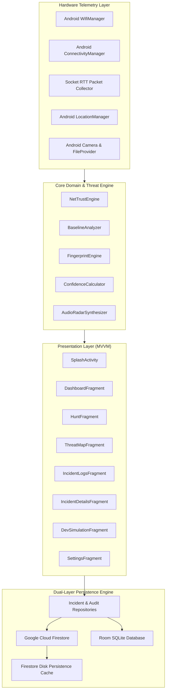

# NetSentinel — Master Context & Project Source of Truth

> **Single Source of Truth** for AI models, developers, and evaluators reviewing the **NetSentinel** project for the **Application Development Lab (ADL)** course.

---

## 1. Executive Summary & Course Context

- **Course:** Application Development Lab (ADL)
- **Project Name:** NetSentinel (v1.0.0-PRO)
- **Engine:** NetTrust Security & Threat Engine (v2.4)
- **Application Type:** Enterprise Mobile Network Security Auditor, Rogue AP Hunter & Forensic Incident Recorder
- **Target Platform:** Android (Min SDK 26, Target SDK 34, Compile SDK 34)
- **Language & Stack:** Kotlin 1.9.22, Android Gradle Plugin 8.2.2, Gradle 8.2, Jetpack Architecture (MVVM)
- **Primary Database:** Dual-Layer Architecture — **Google Firebase Cloud Firestore** (Cloud + Offline Disk Persistence) & **Room SQLite 2.6.1** (Local on-device cache)

---

## 2. ADL Course Roadmap & 4-Task Alignment

| Task | Course Requirement | NetSentinel Implementation Status | Detailed Features Delivered |
| :--- | :--- | :--- | :--- |
| **Task 1** | **Design of Pages & Navigation** | ✅ **COMPLETED** | • 8 fully designed and styled screens.<br>• Dynamic theme resolution supporting both **Dark Cyber Theme** and **Day Light Theme**.<br>• Single-activity 5-tab bottom navigation (`Dashboard`, `Hunt`, `Map`, `Logs`, `Settings`) plus modal/sub-flow screens. |
| **Task 2** | **Database & Network Logic** | ✅ **COMPLETED** | • Live hardware network telemetry using Android `WifiManager` and `ConnectivityManager`.<br>• Real packet socket RTT latency measurement.<br>• Algorithmic `NetTrustEngine` for real-time security scoring (0–100 scale).<br>• **Firebase Cloud Firestore** with `PersistentCacheSettings` unlimited disk cache.<br>• **Room SQLite** local persistence.<br>• Developer Attack Simulation Sandbox for controlled vulnerability injection. |
| **Task 3** | **Multimedia, Maps, Location & Sensors** | ✅ **COMPLETED** | • **Audio Radar Synthesizer**: Low-level PCM sine-wave synthesis via Android `AudioTrack` API.<br>• **Dual Map Engines**: Hardware-accelerated 60fps Vector Hex Map (`CyberMapView`) + OpenStreetMap (`osmdroid`) fallback.<br>• **GPS Sensor Integration**: Hardware `LocationManager` latitude/longitude binding.<br>• **Camera Evidence Capture**: Android Camera Intent with secure `FileProvider`.<br>• **Forensic Report Share**: Formatted plain-text forensic report generation (`INCIDENT_REPORT_INC-XXXX.txt`). |
| **Task 4** | **AI/ML/Chatbot & Predictive Analytics** | ⏳ *Scheduled for Next Phase* | Planned for automated anomaly inference and generative attack mitigation runbooks. |

---

## 3. High-Level System Architecture



---

## 4. Database Architecture & Schema

NetSentinel implements a resilient **Offline-First Dual-Layer Architecture** satisfying both cloud synchronization requirements and offline operational guarantees:

### A. Firebase Cloud Firestore
- **SDK:** `com.google.firebase:firebase-bom:32.7.4` + `firebase-firestore-ktx`
- **Plugin:** `com.google.gms.google-services:4.4.1`
- **Configuration File:** `app/google-services.json`
- **Cache Policy:** `PersistentCacheSettings.newBuilder().build()` enabled via `FirestoreManager.kt`. Guarantees zero crashes and full offline persistence when internet connectivity is unavailable.

#### Collection 1: `incidents`
```json
{
  "id": "INC-1346",
  "auditSessionId": "AUDIT-2895",
  "title": "Hardware Audit Anomaly: ARP_SPOOFING",
  "timestampFormatted": "2026-09-25 00:54:54",
  "threatScore": 30,
  "severity": "HIGH",
  "status": "FLAGGED",
  "aiAnalysis": "Gateway IP address changed from 192.168.1.1 to 10.0.2.2. Potential ARP spoofing or unannounced subnet reconfiguration.",
  "ssid": "AndroidWifi",
  "bssid": "00:13:10:85:FE:01",
  "gatewayIp": "10.0.2.2",
  "securityType": "Open",
  "gpsCoordinates": "37.421998, -122.084000",
  "photoUri": null,
  "syncedAtMs": 1790276094717
}
```

#### Collection 2: `audit_sessions`
```json
{
  "id": "AUDIT-2895",
  "startTimeMs": 1790276094151,
  "endTimeMs": 1790276094151,
  "trustScore": 30,
  "ssid": "AndroidWifi",
  "bssid": "00:13:10:85:FE:01",
  "status": "ANOMALIES_FLAGGED",
  "syncedAtMs": 1790276094151
}
```

### B. Room SQLite Database (`2.6.1`)
- **Entities:** `IncidentEntity`, `AuditSessionEntity`
- **DAOs:** `IncidentDao`, `AuditDao`
- **Database Class:** `NetSentinelDatabase.kt` (exportSchema = false)
- **Role:** Immediate local reactive caching via Kotlin Coroutines `Flow`.

---

## 5. Algorithmic Threat Detection Engine (`NetTrustEngine`)

The **NetTrust Score** is a deterministic, explainable security rating on a scale of **0 to 100**:
$$\text{NetTrust Score} = 100 - \sum \text{Anomaly Deductions}$$

### Penalty Deduction Table
| Anomaly Vector | Detected Condition | Severity | Penalty | Security Justification |
| :--- | :--- | :--- | :--- | :--- |
| **Security Downgrade** | `securityType == "Open"` or `"None"` | **CRITICAL** | **−45 pts** | Unencrypted channel enables passive over-the-air packet sniffing. |
| **Rogue DNS Resolver** | Active DNS not in trusted set | **CRITICAL** | **−40 pts** | High probability of DNS hijacking / credential harvesting. |
| **Gateway ARP Drift** | Gateway IP/MAC changes from baseline | **HIGH** | **−30 pts** | Potential ARP cache poisoning / Man-In-The-Middle (MITM). |
| **RF Packet Jamming** | Packet loss > 20% | **HIGH** | **−25 pts** | Elevated loss indicative of deauthentication flood or RF interference. |
| **Latency Path Hijack** | Socket RTT > 250 ms | **MEDIUM** | **−15 pts** | Anomalous network rerouting or deep packet inspection overhead. |
| **Evil Twin AP** | Duplicate SSID with alien BSSID | **CRITICAL** | **−50 pts** | Rogue cloned access point attempting forced client re-association. |

---

## 6. Multimedia, Sensors & Custom Views (Task 3)

### 1. Audio Radar Synthesizer (`AudioRadarSynthesizer.kt`)
- Generates dynamic acoustic pings using Android's **`AudioTrack`** API in `MODE_STATIC` / `MODE_STREAM`.
- Calculates real-time 16-bit linear PCM sine waves at sample rate 44.1 kHz.
- Modulation: Frequency shifts between **440 Hz (far / low RSSI)** and **1760 Hz (near / high RSSI)**, with ping repetition intervals shrinking from 1000 ms to 100 ms as signal strength increases.

### 2. Dual Map Engine (`ThreatMapFragment.kt`)
- **Engine 1 (Primary):** `CyberMapView.kt` — Custom 60fps hardware-accelerated 2D Vector Canvas rendering an interactive radar sweep, concentric range rings, and hex AP nodes with dynamic threat aura glows.
- **Engine 2 (Secondary):** `org.osmdroid:osmdroid-android:6.1.18` — Free open-source street map displaying real GPS coordinates without requiring proprietary Google Maps billing or API keys.

### 3. Forensic Evidence & Reporting (`IncidentDetailsFragment.kt`)
- **Camera Evidence:** Captures high-resolution images via `MediaStore.ACTION_IMAGE_CAPTURE`, saving to private cache directory and resolving URIs through Android `androidx.core.content.FileProvider`.
- **Forensic Plaintext Export:** Generates formatted cryptographic incident dossiers (`INCIDENT_REPORT_INC-XXXX.txt`) and exposes them via Android's native share intent sheet.

---

## 7. Directory Structure & Key Codebase Files

```
d:/Coding/NetSentinal/
├── app/
│   ├── google-services.json             # Firebase configuration file
│   ├── build.gradle.kts                 # App dependencies, plugins & SDK specs
│   └── src/main/
│       ├── AndroidManifest.xml          # Permissions, FileProvider, Activities
│       ├── java/com/netsentinel/app/
│       │   ├── data/model/              # Incident, AuditSession, NetworkSnapshot
│       │   ├── database/
│       │   │   ├── FirestoreManager.kt  # Cloud Firestore API & queries
│       │   │   ├── NetSentinelDatabase  # Room SQLite DB configuration
│       │   │   ├── dao/                 # IncidentDao, AuditDao
│       │   │   └── entity/              # IncidentEntity, AuditSessionEntity
│       │   ├── engine/
│       │   │   ├── ThreatEngine.kt      # NetTrust core scoring logic
│       │   │   ├── BaselineAnalyzer.kt  # Gateway, DNS, and cipher drift rules
│       │   │   ├── FingerprintEngine.kt # Multi-vector AP fingerprinting
│       │   │   └── ConfidenceCalculator # Numerical confidence mapping
│       │   ├── network/
│       │   │   ├── NetworkScanner.kt    # Telemetry orchestrator
│       │   │   ├── RealWifiCollector.kt # WifiManager hardware reader
│       │   │   ├── RealConnectivity    # Gateway & DNS route resolver
│       │   │   └── RealPacketCollector  # Socket RTT latency pinger
│       │   ├── repository/
│       │   │   ├── RoomIncidentRepository.kt # Dual Room + Firestore incident sync
│       │   │   └── RoomAuditRepository.kt    # Dual Room + Firestore audit sync
│       │   ├── ui/
│       │   │   ├── custom/
│       │   │   │   ├── CircularTrustScoreView.kt # Hardware-accelerated gauge
│       │   │   │   ├── CyberMapView.kt           # 60fps Vector Hex Map
│       │   │   │   └── SignalRadarMeterView.kt   # Analog RSSI sweep meter
│       │   │   ├── dashboard/   # DashboardFragment & ViewModel
│       │   │   ├── hunt/        # HuntFragment & AudioRadarSynthesizer
│       │   │   ├── map/         # ThreatMapFragment & OSM engine
│       │   │   ├── logs/        # IncidentLogsFragment & Details
│       │   │   ├── devsim/      # DevSimulationFragment (Attack sandbox)
│       │   │   └── settings/    # SettingsFragment & ViewModel
│       │   └── utils/
│       │       └── PermissionManager.kt # Fine Location, Wi-Fi & Camera permissions
│       └── res/
│           ├── layout/          # All 8 screen XML layouts
│           ├── values/colors.xml# Theme tokens (Dark Cyber vs Day Light)
│           └── xml/file_paths.xml # FileProvider paths for photo & report export
├── build.gradle.kts             # Root Gradle plugin definitions
└── context.md                   # This master source of truth document
```

---

## 8. Live Demonstration Protocols for Evaluators

### Protocol A: Real Hardware Threat Demonstration (The Open Hotspot Test)
1. Turn on a mobile hotspot from any secondary phone without a password (Security = `None` / `Open`). Name it `Campus_Guest_WiFi`.
2. Connect the test phone to this hotspot.
3. Open NetSentinel and tap **Start Audit** on the Dashboard.
4. **Observation:**
   - SSID and Gateway resolve live.
   - NetTrust Score drops to **30 / 100 (CRITICAL THREAT)**.
   - Alert flags: *"Network security broadcast is unencrypted OPEN! Data transmitted across this channel is vulnerable to eavesdropping."*
   - Incident is automatically stored in Room SQLite and streamed to Firebase Cloud Firestore.

### Protocol B: Developer Attack Simulation Sandbox
1. Navigate to **Settings** ➔ Tap **Open Developer Attack Simulation Sandbox**.
2. Select any vector (e.g. *Evil Twin AP Rogue Clone* or *ARP Gateway Poisoning Attempt*).
3. Tap **Inject Attack into Local Threat Database**.
4. Navigate to **Incident Logs** to inspect the generated threat report.
5. Open the Firebase Console in any browser to verify real-time document creation in the `incidents` collection.

---

## 9. Firestore Queries Reference (Code & Console)

```kotlin
// 1. Query by severity level
db.collection("incidents").whereEqualTo("severity", "CRITICAL").get().await()

// 2. Query high-risk threats
db.collection("incidents").whereGreaterThanOrEqualTo("threatScore", 70).get().await()

// 3. Query recent audit sessions
db.collection("audit_sessions").orderBy("syncedAtMs", Query.Direction.DESCENDING).limit(10).get().await()

// 4. Real-time stream observation
db.collection("incidents").addSnapshotListener { snapshot, _ -> /* Live WebSocket Stream */ }
```

---

## 10. Frequently Asked Viva Questions (Quick Reference)

1. **Why use both Firebase Firestore and Room SQLite?**  
   *Answer:* It provides an offline-first resilient architecture. Room ensures instant zero-latency UI rendering and 100% offline uptime, while Firestore provides real-time multi-device cloud synchronization and administrative inspection.
2. **What does −50 dBm indicate?**  
   *Answer:* Decibel-milliwatts (logarithmic RF power relative to 1 mW). Negative because received signals are tiny fractions of a milliwatt. −50 dBm denotes an excellent, high-power signal with high link speed.
3. **How does the Audio Radar work without audio files?**  
   *Answer:* It synthesizes pure PCM sine waves in real-time using Android's low-level `AudioTrack` API, dynamically scaling frequency (440 Hz to 1760 Hz) and ping interval proportional to received RSSI.
4. **How are map tiles loaded without Google Maps API keys?**  
   *Answer:* NetSentinel implements a custom 60fps Vector Canvas map (`CyberMapView`) as primary radar, backed by OpenStreetMap (`osmdroid`) which consumes open-source community tile servers without proprietary billing locks.
